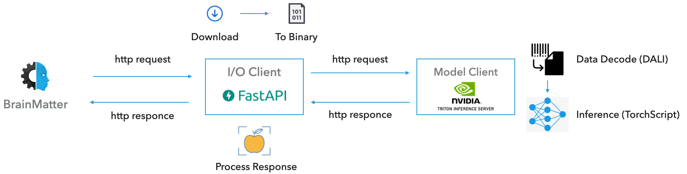

# Triton Inference Server: Detectron2

> [Triton Inference Server](https://developer.nvidia.com/nvidia-triton-inference-server) provides a cloud and edge inferencing solution optimized for both CPUs and GPUs. 


## Info

Triton Inference Server breaks the pipeline into two clients; the __I/O Client Server__ and the __Model Server__. The former bridge the souce and the model server, shaping the data to the expected format and the latter is responsible for the model hosting.

<p align="center">
  
</p>


## Usage


### Run

- __Client Server__

    *For more details, please go [here](./client-server).*

    To launch the **Client Server** via `docker-compose`:
    ```
    docker-compose -f docker/docker-compose.yml up triton-client-server
    ```

    **Enviroment flags:**

    - `HOST`: API host
    - `PORT`: API port
    - `mode`: Serve mode ("debug", "develop" or "production")
    - `TRITON_HOST`: Triton API host
    - `TRITON_PORT`: Triton API port
    - `TRITON_MODEL_PROTOCOL`: Triton model name
    - `LABEL_MAPPING_FILE`: Path to the label mapping json file
    - `NVIDIA_VISIBLE_DEVICES`: Triton model version

    <br />


- __Model Server__

    *For more details, please go [here](./model-server).*

    To launch the **Triton Server** via `docker-compose`: 
    ```
    docker-compose -f docker/docker-compose.yml up triton-model-server
    ```

    **Enviroment flags:**

    - `TRT_MODEL_DIR`: Path to the folder that hosts the triton models


`NOTE`: To set enviroment flags, please use the following: `export ENV_FLAG='<path/to/file>'`


<!-- ### Setup

- __Model Server__: In order to run the Model Server with Triton, we need to setup the server by running `v2/server/scripts/setup_server.sh`. In particular, it will initiallize the following:

    - __Model Setup__: First, we will need to export the model to a framework which is supported by the triton. Here, we will export the model to [`TorchScript`](https://pytorch.org/docs/stable/jit.html), that can run in a high-performance environment such as C++. We will use the script `v2/server/scripts/setup_model.py` to export the detectron2 model, give its configuration file and weights.

     - __DALI Setup__: In order to use DALI as a preprocess pipeline on the triton server, it has to be registed a model. We will use the script `v2/server/scripts/setup_dali.py`. -->

